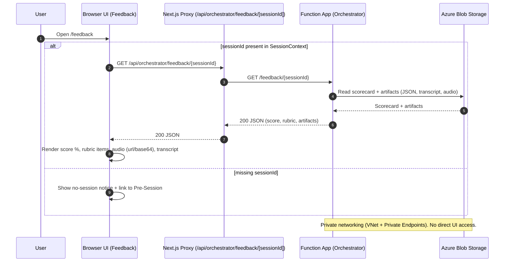

# Sequence Diagram — Feedback & Scoring

```mermaid
sequenceDiagram
    autonumber
    participant U as User
    participant UI as Browser UI (Feedback)
    participant API as Next.js Proxy (/api/orchestrator/feedback/[sessionId])
    participant FA as Function App (Orchestrator)
    participant ST as Azure Blob Storage

    U->>UI: Open /feedback
    alt sessionId present in SessionContext
        UI->>API: GET /api/orchestrator/feedback/{sessionId}
        API->>FA: GET /feedback/{sessionId}
        FA->>ST: Read scorecard + artifacts (JSON, transcript, audio)
        ST-->>FA: Scorecard + artifacts
        FA-->>API: 200 JSON (score, rubric, artifacts)
        API-->>UI: 200 JSON
        UI->>UI: Render score %, rubric items, audio (url/base64), transcript
    else missing sessionId
        UI->>UI: Show no-session notice + link to Pre-Session
    end

    Note over FA,ST: Private networking (VNet + Private Endpoints). No direct UI access.
```
