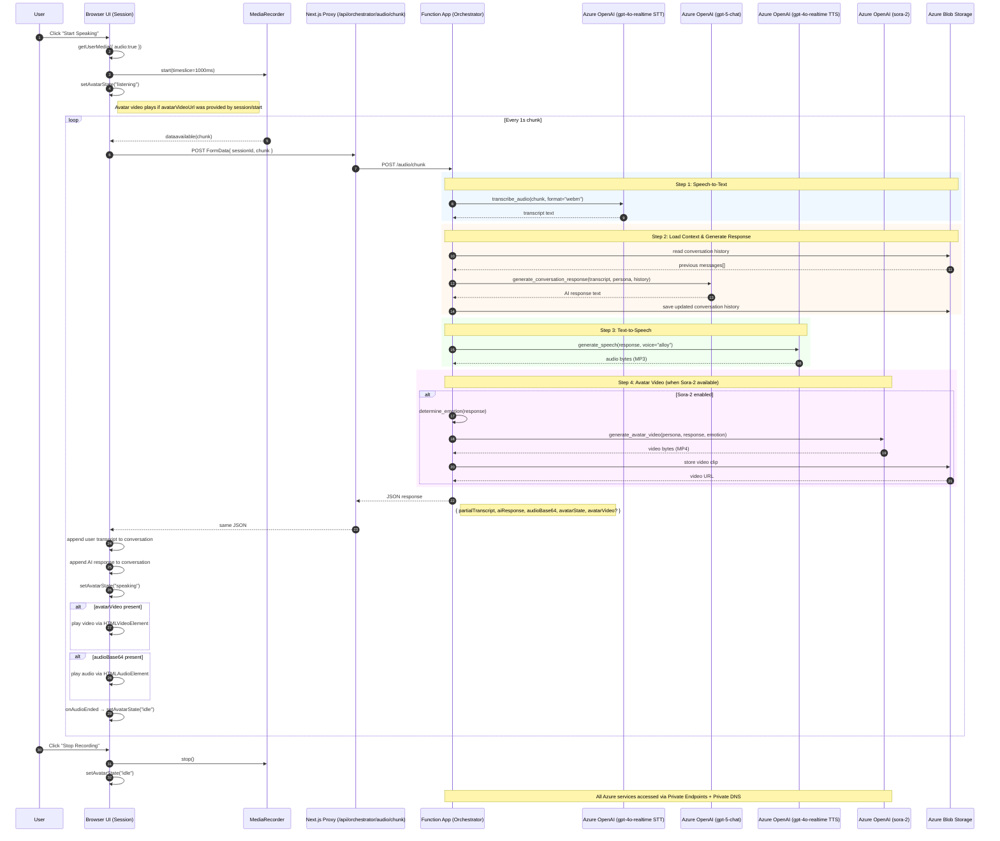

# Sequence Diagram — Session Realtime Audio & Avatar

This diagram illustrates the complete audio processing and avatar video generation flow using:
- **gpt-4o-realtime-preview** for Speech-to-Text (STT) and Text-to-Speech (TTS)
- **gpt-5-chat** for conversational AI responses
- **sora-2** for lip-synced avatar video generation (when available)



## Response Payload Structure

```json
{
  "sessionId": "uuid",
  "partialTranscript": "What the user said",
  "aiResponse": "What the AI customer responds",
  "audioBase64": "base64-encoded MP3 audio",
  "avatarState": "speaking",
  "avatarVideo": {
    "url": "https://storage.blob.../video.mp4",
    "base64": "base64-encoded MP4 video (alternative)",
    "emotion": "interested"
  }
}
```

## Avatar States

| State | Indicator | Description |
|-------|-----------|-------------|
| `idle` | None | Avatar is waiting, no activity |
| `listening` | Blue pulsing dot | User is speaking, avatar is listening |
| `speaking` | Green pulsing dot | Avatar is speaking/playing audio |
| `thinking` | Yellow pulsing dot | Processing user input |

## Graceful Degradation

When components are unavailable:

1. **Sora-2 unavailable:** `avatarVideo` field omitted; UI shows static image or placeholder
2. **TTS fails:** `audioBase64` field omitted; transcript still displayed
3. **STT fails:** Returns `{ partialTranscript: null, message: "No speech detected" }`
4. **LLM fails:** Returns fallback response: "I'm sorry, I didn't catch that. Could you repeat?"
